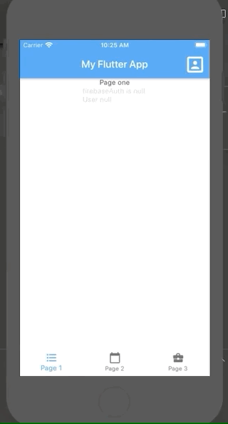

# simple_flutter_auth_app

A simple flutter auth app with a BottomNavigationBar, anonymous log in when the app open and state management with ChangeNotifierProvider.

A lot of element is taken from from https://github.com/delay/flutter_firebase_auth_example, with modification (coming soon) :  
- username (instead of first/last name)
- anonymous sign in when user open the app for the first time
- The state management will be modified, from InheritedWidget to ChangeNotifierProvider

## Getting Started

In order to make this app working after a git clone, you will have to setup a Firebase.
1. $ git clone https://github.com/dleurs/simple_flutter_auth_app.git
2. $ cd simple_flutter_auth_app
3. Go to https://console.firebase.google.com/u/0/ and add a project
4. 
